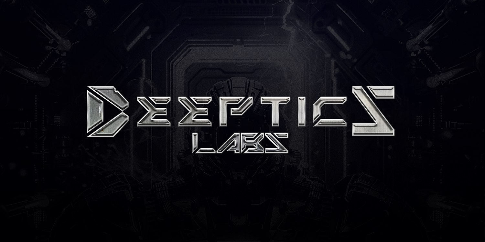

<p align="center">
  
</p>

# Validate Humanoid Compact
> An example of using the SDK to validate a humanoid model in a compact form.

---

## Description
This script is used to validate a humanoid model within the Deeptics Labs SDK environment.
It ensures the model's integrity and compliance with the internal robotics framework.

### 📂 File Location
examples/validate_humanoid_compact.py

### Example Output
```python
print('Validate HUM-CMP-2059: OK')
```
## Structure
```python
db/         — structured database  
sdk/        — Python & TypeScript SDKs  
cli/        — minimal CLI  
docs/       — guides  
examples/   — runnable samples
```

## How to Run 
```python
python3 -m venv deeptics_venv
source deeptics_venv/bin/activate
cd sdk/python && pip install -e .
python examples/validate_humanoid_compact.py
```
<p align="center"> © 2025 <strong>Deeptics Labs</strong> — Modular Robotics Framework </p> 
